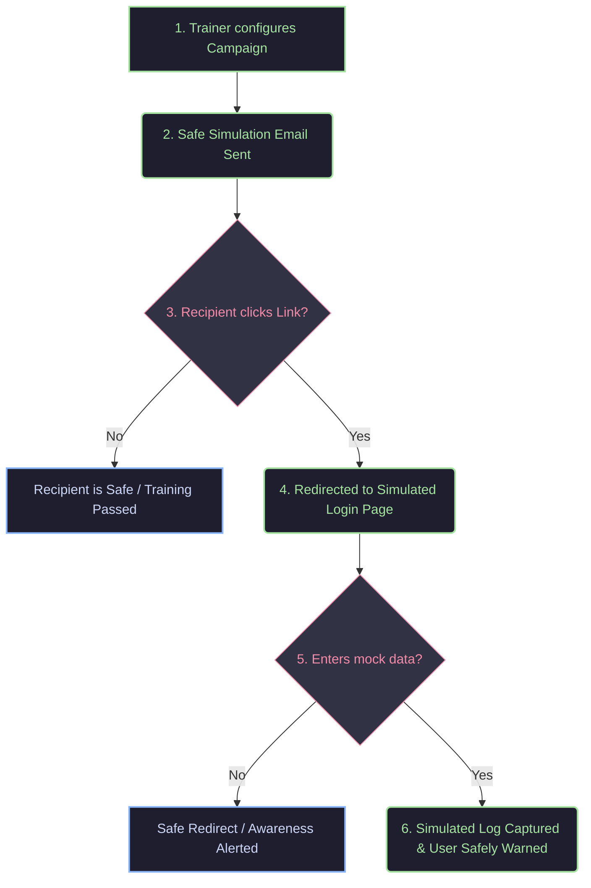

# 🌐 Phishing Awareness Simulation Platform

## 🎓 Academic Project Overview
* **Institution:** Department of Computer Science and Engineering, Ramdeobaba University, Nagpur
* **Author:** Advait Kawale
* **Academic Level:** 2nd Year CSE
* **Purpose:** Controlled Educational Demonstration & Security Awareness Training

---

## 🎯 Educational Mission & Focus

This project is a **controlled security awareness simulation utility** built as an academic study on the human factors of cybersecurity. Security awareness simulations are critical in educating non-technical users about **social engineering tactics**, transforming abstract theoretical threats into observable, hands-on learning experiences.

The primary objective is to demonstrate **human vulnerability points** in cybersecurity and train users to look for key visual and technical indicators of credential-harvesting attacks (e.g., domain mismatches, lack of secure indicators, and psychological urgency triggers).

> [!WARNING]
> **LEGAL AND ETHICAL DISCLAIMER**
> This software is strictly intended for **authorized educational simulations, local testing, and academic grading purposes**. 
> * It must **never** be deployed in uncontrolled settings or used against real users without their explicit, prior written consent.
> * The author and developers assume **no liability** for misuse, unauthorized installations, or damage resulting from the deployment of this tool outside of authorized academic and corporate training boundaries.

---

## 💡 How Phishing Awareness Simulators Work

A standard phishing simulation mirrors real-world social engineering attack vectors to assess user vulnerability. In a controlled training scenario, the lifecycle follows a structured loop:



1. **Campaign Configuration:** An administrator sets up a simulated campaign containing custom mock emails and safe templates.
2. **Delivery Stage:** The simulated message is routed to designated test inboxes (using sandboxed environments like Mailtrap).
3. **Observation:** If the test subject opens the link, they land on a localized mock landing page.
4. **Redirection & Remediation:** The platform safely catches the interaction, alerts the user that this was a test, and redirects them to the official resource alongside micro-learning modules explaining what indicators they missed.

---

## 🛠️ Technology Stack

* **Core Framework:** [Laravel 10.x](https://laravel.com) (Expressive PHP MVC engine for secure routing and session handling)
* **Frontend styling:** [Tailwind CSS](https://tailwindcss.com) & Blade Templates (Creating visual representations of common interfaces)
* **Database engine:** MySQL / SQLite (Campaign metric storage, event logs, and training telemetry)
* **Testing Sandbox:** Laravel Mailer integrated with Mailtrap or local SMTP servers

---

## 🏗️ Core System Structure

* **Campaign Management:** Full CRUD interface allowing administrators to create, schedule, and edit simulation runs.
* **Telemetry Dashboard:** Aggregates overall campaign results, tracking click-through rates and completion times for academic data collection.
* **Redirection Pipeline:** Safe and automatic route forwarding that intercepts active tests and redirects users to security awareness advice pages.

---

## 🚀 Local Installation & Deployment

To run this project locally in a sandboxed, loopback testing environment:

### Prerequisites:
* PHP $\ge 8.1$
* Composer
* Node.js & NPM
* Local database server (e.g., MySQL, SQLite)

### Installation Steps:

1. **Navigate to the Project Root:**
   ```bash
   cd PhishingSim
   ```

2. **Install Composer Dependencies:**
   ```bash
   composer install
   ```

3. **Install and Build Frontend Assets:**
   ```bash
   npm install
   npm run build
   ```

4. **Environment Configuration:**
   Copy the example environment configuration file:
   ```bash
   cp .env.example .env
   ```
   *Generate your application encryption key:*
   ```bash
   php artisan key:generate
   ```
   *Edit the `.env` file to configure your local database connection and local sandboxed SMTP settings (e.g., Mailtrap).*

5. **Run Migrations & Seed Database:**
   ```bash
   php artisan migrate
   ```

6. **Start Local Development Server:**
   ```bash
   php artisan serve
   ```
   *Open [http://127.0.0.1:8000](http://127.0.0.1:8000) in your web browser to access the administrator dashboard.*
